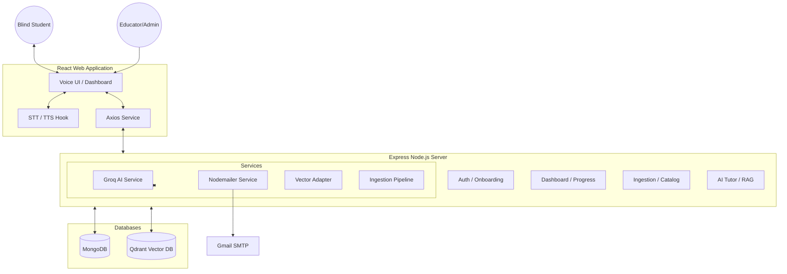

# DrishtiVani Architecture

DrishtiVani is an AI-powered educational platform designed specifically for blind and visually impaired students. It uses a voice-first interface to enable students to "read" textbooks, take quizzes, and track their progress hands-free.

## System Overview

## Tech Stack

-   **Frontend**: React.js, Tailwind CSS, Framer Motion (for feedback animations), Lucide Icons.
-   **Backend**: Node.js, Express.js.
-   **Databases**: 
    -   **MongoDB**: Stores user profiles, structured textbook data, progress records, and chapter metadata.
    -   **Qdrant**: High-performance vector database used for Retrieval-Augmented Generation (RAG).
-   **AI Stack**:
    -   **Groq SDK**: Powers fast LLM inference for content generation, chat tutoring, and quiz creation.
    -   **Nodemailer**: Handles professional progress report emails.
-   **Voice Interface**:
    -   **SpeechRecognition (Web Speech API)**: Converts student speech to text commands.
    -   **SpeechSynthesis (Web Speech API)**: Provides the natural sounding "teacher voice".

## Core Workflows

### 1. Textbook Ingestion (Admin)
1.  Admin uploads an NCERT PDF.
2.  Backend renders each page to images (for OCR/context) and extracts text.
3.  Groq AI processes the data to generate:
    -   Vivid descriptions of images and diagrams.
    -   Meaningful, spoken-optimized teaching segments.
    -   Automated multiple-choice quizzes.
4.  Segments are embedded into vectors and stored in **Qdrant** for context-aware chat.

### 2. Voice-Driven Learning (Student)
1.  Student selects a subject via voice.
2.  The assistant reads out the pre-generated lesson segments.
3.  Between segments, the student provides voice confirmation (e.g., "Ready for more").
4.  If the student asks a question, the system performs a vector search in Qdrant and uses Groq to provide a context-accurate answer.

### 3. Progress Tracking & Reporting
1.  Students take mid-chapter and final quizzes via voice.
2.  Scores and "weak concepts" are tracked in MongoDB.
3.  The dashboard provides a real-time summary, filtered strictly by the student's grade.
4.  The student can say "Send report" to mail a detailed progress summary to their trainer.
