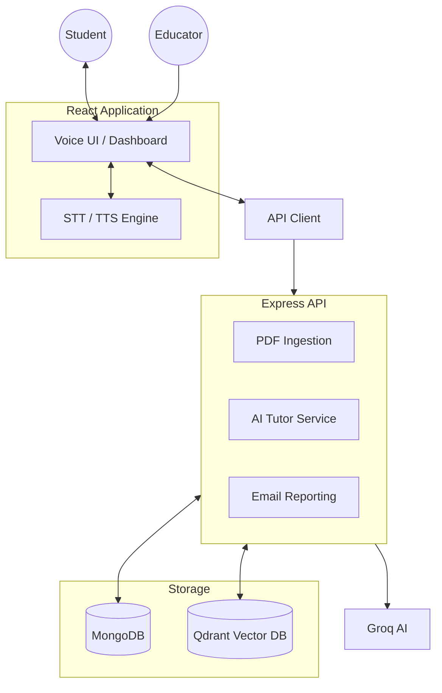

# 🟠 DrishtiVani: AI for Accessible Education

**DrishtiVani** is an AI-powered educational platform designed specifically for blind and visually impaired students. By providing a voice-first, hands-free interface, it empowers students to explore textbooks, engage with an AI tutor, and track their academic progress independently.

---

## 🏗️ Architecture



## 🚀 Key Features

-   **Voice-First Navigation**: Move through the app entirely via speech (e.g., "Go to dashboard", "Open science").
-   **Hands-Free Learning**: Textbooks are pre-processed into descriptive segments optimized for audio-based learning.
-   **Interactive AI Tutor**: Ask questions about any part of the lesson and get context-aware answers using RAG (Qdrant).
-   **Automated Quizzes**: Voice-based mid-chapter and final quizzes track understanding.
-   **Class-Filtered Content**: Students only see textbooks relevant to their specific grade.
-   **Progress Reports**: Mail detailed achievement reports to trainers with a simple "Send report" voice command.

## 🛠️ Tech Stack

-   **Frontend**: React, Tailwind CSS, Framer Motion.
-   **Backend**: Node.js, Express.
-   **AI/ML**: Groq SDK (LLM), Vector RAG with Qdrant.
-   **Database**: MongoDB (User/Metadata).
-   **Communication**: Nodemailer (Gmail SMTP).

---

## 📖 Setup Guide

### 1. Prerequisites
- Node.js (v18+) & npm.
- Docker Desktop (for Qdrant).
- MongoDB instance (local or Atlas).
- Groq Cloud API Key.

### 2. Environment Setup
Create a `.env` file in the root directory based on `.env.example`:
```bash
GROQ_API_KEY=your_key
MONGODB_URI=your_mongodb_uri
GMAIL_USER=your_gmail
GMAIL_APP_PASSWORD=your_app_password
REPORT_EMAIL=recipient_email
```

### 3. Run Qdrant (Vector DB)
```bash
docker pull qdrant/qdrant
docker run -p 6333:6333 -p 6334:6334 -v "$(pwd)/qdrant_storage:/qdrant/storage:z" qdrant/qdrant
```

### 4. Install & Start
Open two terminals:

**Terminal 1 (Backend)**:
```bash
cd backend
npm install
npm run dev
```

**Terminal 2 (Frontend)**:
```bash
cd frontend
npm install
npm run dev
```

---

## 🗣️ Voice Commands to Try

-   **"What is my progress?"**: Hear a verbal summary of your scores and completion.
-   **"Send report"**: Mail your progress details to your trainer.
-   **"Go to Admin"**: Open the educator upload panel.
-   **"Start [Subject Name]"**: Begin your daily lesson.
-   **"Go Back"**: Return to the previous screen.

---

## 🧹 Database Reset
To wipe all data, textbooks, and progress for a fresh start:
```bash
cd backend
npm run reset-db
```
